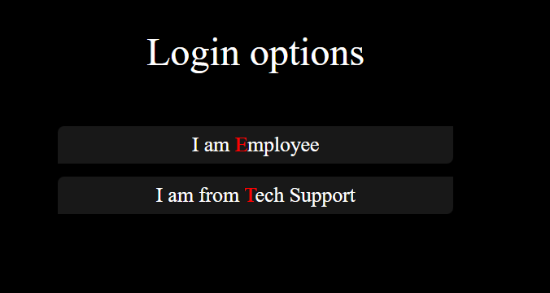
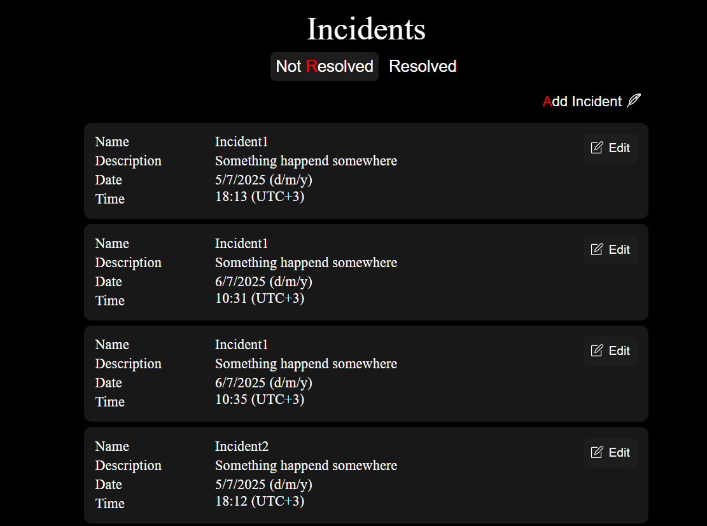
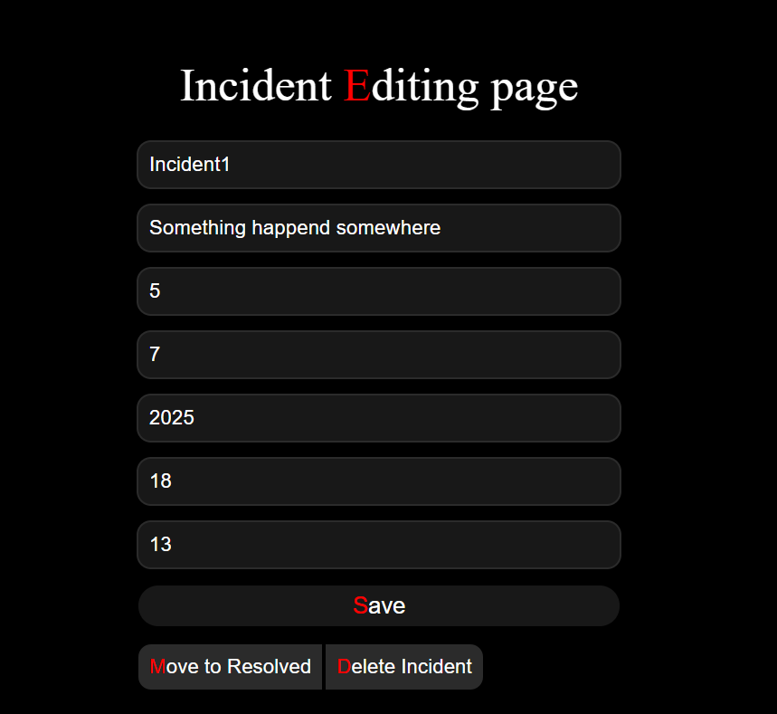
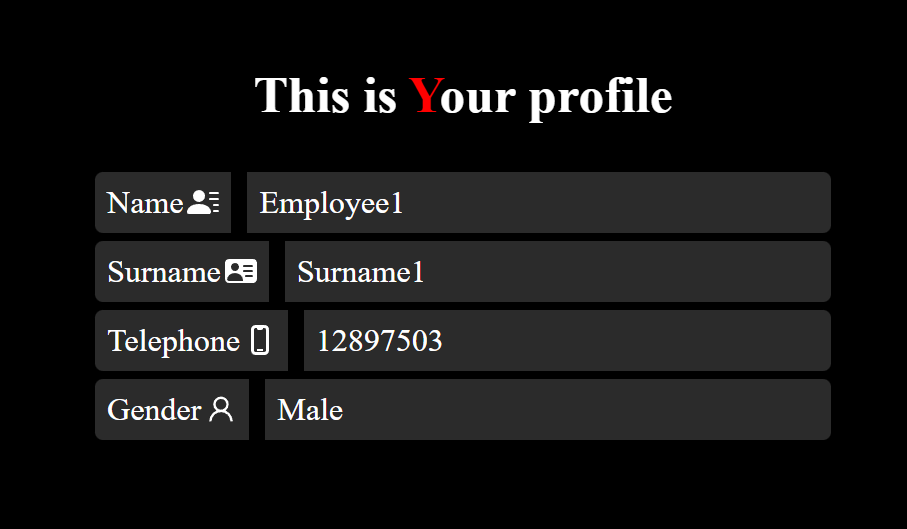

# Additional Information
[Restructured into microservices backend](https://github.com/Rope-IRL/IncidentsDecisionMicroservices)
# Project Description
This project is a web-based application designed to streamline the reporting and handling of workplace incidents. Employees can log incidents through a dedicated interface, providing relevant details for each occurrence. A specialized Tech Support role is available to manage these reports — including the ability to edit, delete, and mark incidents as resolved.

# Project Frameworks
## Backend
The backend of the Incident Management System is developed using ASP.NET Core, offering a fast, scalable, and maintainable API layer for handling incident reporting and resolution workflows. It is structured to support secure operations and clean data access patterns.

- Framework: ASP.NET Core – used to build RESTful APIs that manage incidents and enforce role-based permissions.

- Database: PostgreSQL – a powerful, open-source relational database system used for reliable data storage and querying.

- ORM: Entity Framework Core (EF Core) – used with a code-first approach to define data models and manage schema migrations, enabling seamless integration with PostgreSQL.

- Security: Implements role-based authorization to restrict sensitive operations (edit, delete, resolve) to Tech Support users.

- Validation & Error Handling: Ensures clean API responses and input integrity through centralized validation and exception handling.

- RESTful Design: Follows REST principles for consistent and predictable API behavior, enabling easy consumption from the Next.js frontend.

This backend stack delivers a solid foundation for secure, efficient, and scalable incident management.Here 

~~Let me know if you'd like to include specifics like authentication mechanisms, logging, or architecture patterns (e.g., Clean Architecture, Repository Pattern).~~

## Frontend

The frontend of the Incident Management System is developed using Next.js, delivering a fast, responsive, and modern user interface for reporting and managing incidents. The application is optimized for performance and usability, with clear separation of concerns and simple, maintainable architecture.

- Framework: Next.js – used for building server-rendered and statically generated React applications, providing optimized routing and performance out of the box.

- State Management: Zustand – a lightweight, intuitive state management library used to handle global state such as user roles, incident data, and UI flags.

- Data Fetching: Uses the native fetch API to communicate with the ASP.NET Core backend via RESTful endpoints, ensuring minimal dependencies and full control over request handling.

- Routing: Leverages Next.js’ file-based routing system for intuitive navigation, including protected routes for role-based access (e.g., Tech Support views).

- Component-Based Architecture: Built with reusable, modular React components to keep the UI consistent and maintainable.

- Role-Based UI: Dynamically adjusts available actions and views based on the user's role, ensuring secure and user-specific access.

This frontend stack ensures a clean developer experience, smooth user interaction, and tight integration with the backend services.

# Some Browser Images

